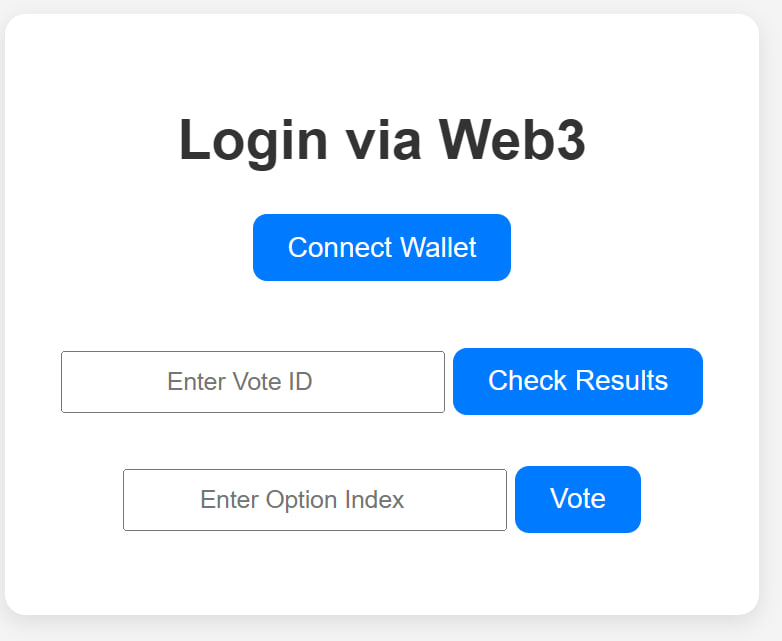
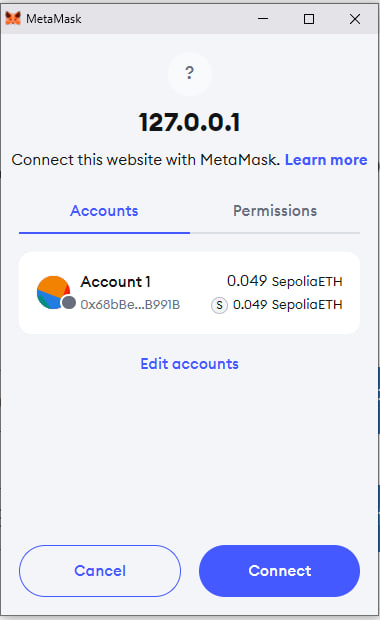
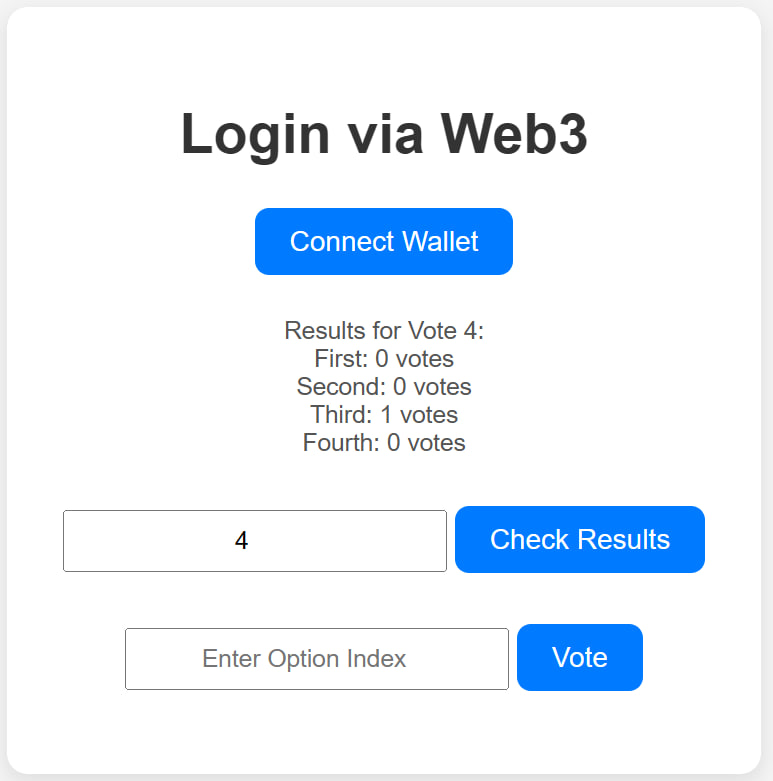
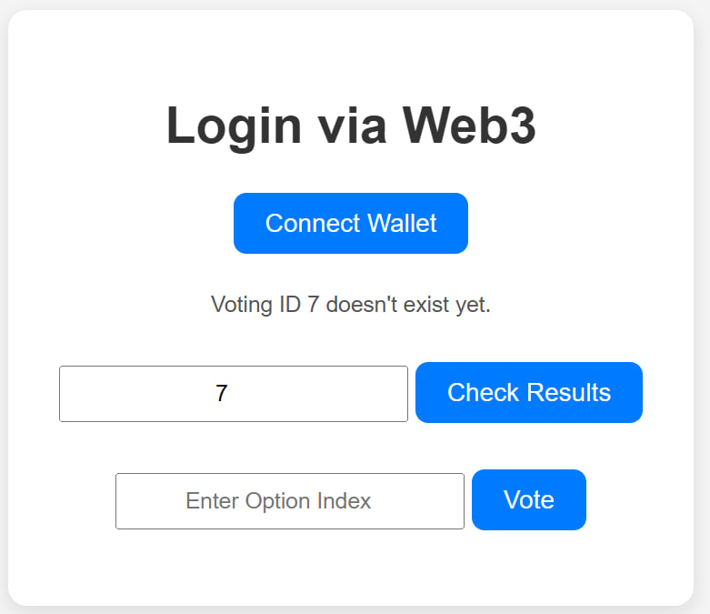
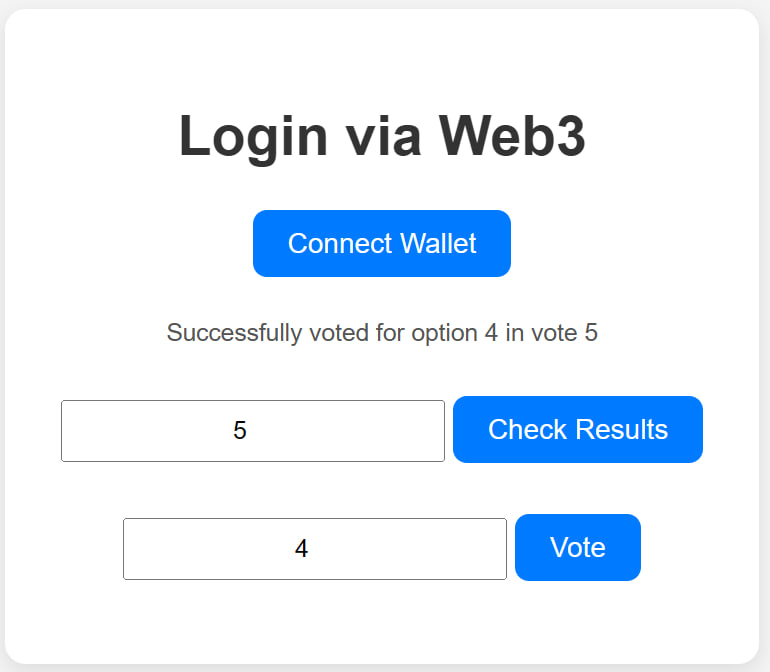
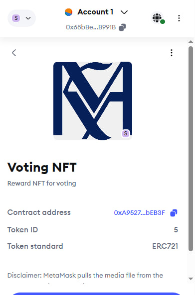

# Voting NFT Project

The **Voting NFT Project** is a decentralized voting system built on the Ethereum blockchain that rewards participants with NFTs for their votes. By leveraging Ethereum smart contracts, this project ensures a secure, transparent, and immutable voting process. Participants who engage in voting are rewarded with non-fungible tokens (NFTs), incentivizing active involvement in the voting process.

## Features

- **Decentralized Voting**: Create and participate in votes directly on the blockchain, ensuring transparency and tamper-proof results.
- **NFT Rewards**: Each voter receives an NFT as a reward for participating in a vote.
- **Real-time Voting Results**: View voting results and status in real time on the frontend.
- **MetaMask Integration**: Easily connect your MetaMask wallet to participate in the voting system.
- **Vote Verification**: Prevents double voting and ensures only one vote per address through smart contract validation.
- **Time-based Voting**: Votes have specific start and end times, and users can view if the voting is ongoing or has ended.

## Technology Stack

- **Solidity**: Used for writing smart contracts on the Ethereum blockchain.
- **Hardhat**: A development framework for Ethereum, used to deploy and test smart contracts.
- **Ethers.js**: A library for interacting with Ethereum, providing methods to read and send transactions from the frontend.
- **Web3**: A JavaScript library for interacting with the Ethereum blockchain.
- **HTML/JavaScript**: Frontend implementation of the application.

## Prerequisites

Before you begin, make sure you have the following installed:

- **Node.js (v14+ recommended)**: For running the backend and installing dependencies.
- **MetaMask browser extension**: For interacting with the Ethereum blockchain.
- **Git**: For cloning the repository and version control.

## Installation

Follow these steps to set up the project on a new machine:

### 1. Clone the repository

```bash
git clone [your-repository-url]
cd voting-nft
```

### 2. Install dependencies:

```bash
npm install
```

### 3. Set up your environment variables

Create a `.env` file in the root directory and add the following configuration:

```bash
PRIVATE_KEY=your_private_key
SEPOLIA_URL=https://sepolia.infura.io/v3/your_infura_project_id
```

## Smart Contract Deployment

### 1. Compile the smart contracts:

```bash
npx hardhat compile
```

This will compile the Solidity smart contracts into bytecode.

### 2. Deploy to Sepolia testnet:

First deploy `RewardNFT` contract by running:

```bash
npx hardhat run scripts/deploy.ts --network sepolia
```
Then deploy `VotingContractNFTReward` and `VotingRegistry`:

```bash
npx hardhat run scripts/deployAll.ts --network sepolia
```

After deployment, make sure to save the contract addresses.

## 3. Update contract addresses in the frontend

Once the contracts are deployed, you will have contract addresses that need to be updated in the frontend. In the `script.js` file, update the contract address as follows:

```bash
const votingContractAddress = 'your_deployed_contract_address';
```

## Frontend Setup

### 1. Navigate to the frontend directory

```bash
cd frontend
```

### 2. Serve the frontend

You can use any local server to serve the frontend. If you're using Visual Studio Code, the Live Server extension is a great tool for this.

Alternatively, you can run:

```bash
npx live-server

```

This will start the frontend on a local server, typically at `http://localhost:8080`.

## Usage


### Creating a Vote
To create a new vote, use the following deployment script. This script will deploy a new vote to the smart contract and make it available for participation.

```bash
npx hardhat run scripts/createVote.ts --network sepolia
```

### Participating in a Vote

1. Connect MetaMask wallet using the frontend interface
2. Enter the Vote ID and Option Index
3. Click "Vote" button
4. Confirm the transaction in MetaMask

### Checking Results

1. Enter the Vote ID in the interface
2. Click "Check Results"
3. View the results if the voting period has ended

### Performing Operations via TypeScript Files

All the operations can be done by executing the corresponding TypeScript files in the `scripts` folder:

`vote.ts` (Cast your vote by providing the vote ID and option index); `checkResults.ts`(Fetch and display the results of a specific vote) etc.

### Initial Setup Requirements

Before you can create votes and interact with them, the following setup steps are required:

### 1. Register the Voting Contract:

To allow voting contracts to be managed and tracked, you must first register the voting contract with the `VotingRegistry` using the `registerVotingContract.ts` script. This script will ensure your voting contract is registered on the network, enabling participation and tracking.

Run the script with:

```bash
npx hardhat run scripts/registerVotingContract.ts --network sepolia
```

### 2. Transfer NFT Ownership:

For the proper functioning of NFT rewards, you must transfer ownership of the minted NFTs to the voting contract by executing the `transferNFTOwnership.ts` script.

Run the script with:

```bash
npx hardhat run scripts/transferNFTOwnership.ts --network sepolia

```


### Smart Contract Functions

- **vote(uint256 voteId, uint256 optionIndex)**: Cast a vote
- **getResults(uint256 voteId):** Get voting results
- **getOptions(uint256 voteId):** Get voting options
- **votes(uint256 voteId):** Get vote details

## Troubleshooting

### Common Errors

- **"Already voted"**: This error occurs when the wallet has already voted in the current voting session. It is part of the contract's logic to prevent double voting.

- **"Transaction reverted"**: This could occur if the transaction fails due to insufficient funds or invalid parameters (e.g., invalid vote ID or option index).

- **"MetaMask not installed"**: Ensure that MetaMask is installed and properly configured in your browser.

- **"Valid Positive Vote ID"**: Ensure the vote ID entered is a positive integer. A valid vote ID corresponds to an existing vote.

- **"Valid Option Index (0 or Greater)":** Option index should be a valid number starting from 0

- **"Voting ID Doesn't Exist":** The voting ID entered should correspond to an existing vote. If the voting ID doesn't exist or hasn't been created yet, an error will occur.

## Examples of a working project:

## 🧪 Examples of a Working Project

**My SepoliaETH** address: 0x68bBe298aC55737FFe7CAF717100B47F29EB991B

**RewardNFT** address: 0xA9527780Bd01D5F417Aa56e72270bFD16F7bEB3F

**VotingRegistry** address: 0xe999124667e94AAc413281CdBaB6c446c3e4A353

**VotingContractNFTReward** address: 0x11781Bff3e10D817202fA58E4aD3e7a3fdc775E9


### Interface



### Login with MetaMask



### Results of a Completed Vote



### Error: Invalid Input




### Ongoing Vote Attempt


### Error: Voting ID Not Found


### Submitting a Vote



### Already Voted Message


### Results for Vote ID 5


### Received NFT Reward


